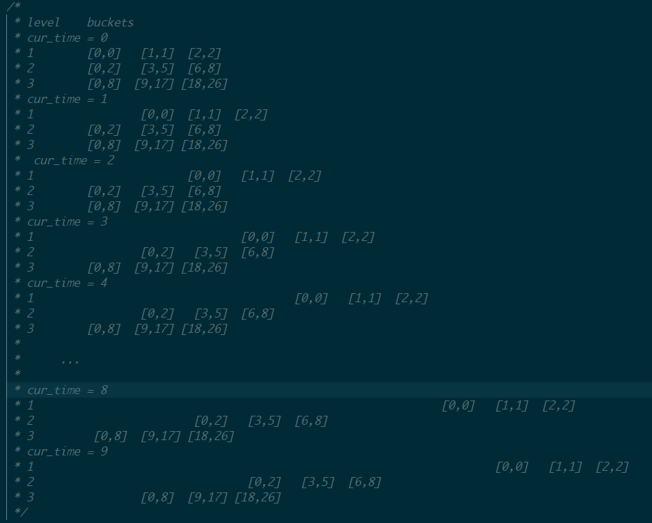
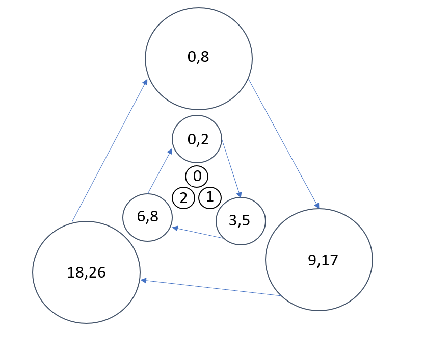

# WebServer

### 初衷

这是我第一个除了实验室项目之外自己完整手写并且实现很多新功能的项目，最开始是打算为了找工作应付一下，后来随着对服务端编程理解的加深，开始考虑一些新的东西了，项目在6月份的时候实现了零拷贝，后来发现大文件传输缓存IO的话会用PageCache，这样小的热点数据就没法充分利用缓存空间了，又改成了异步IO+直接IO的方式，然后后续会对小的文件使用零拷贝这种方式。

后来4月份的时候，同学在研究kafka，在时间事件那块学习时间轮的时候，我们俩进行了激烈的讨论，起初我并没有完全理解多重时间轮到底是怎么运转，一直以为说的复用Bucket是，第一层Wheeling结束的时候重新分发这种样子，最后一发不可收拾，后来仔细阅读量kafka对应的源码，由于是scala写的，有些东西还是不太理解像延迟队列这些，中旬的时候想着自己也实现一个多重时间轮吧，就开始对项目改来改去。

我始终觉得自己对于知识理解很浅，很多东西浮于表面，Cancel changes像考研时候那样眼高手低，遂决定真正自己将所学知识用上，手写一个属于自己的项目。

当然我发布在git hub上的代码已经跟我线下自己的代码有很大不同了，很多功能还没有完全同步过来，所以这个项目我会持续维护。

期间我大致读过这些书：

Linux多线程服务端编程(muduo)，Linux高性能服务器编程，程序员的自我修养，C++ Primer，STL源码解析，redis设计与实现，Mysql是怎么运行的， More Effective C++， Effective C++， 深入理解C++对象模型，操作系统精髓与设计实现

每本书都对我产生了或多或少的影响

### TCPBuffer

We think about a question why use the application layer to send buffers,

At this point we should know that what we said about the server sending is completed is actually written to the os buffer, and the rest can be done by tcp

If you want to send 40KB of data, but the TCP send buffer of the operating system has only 25KB of remaining space, if the remaining 15KB of data has to wait for the TCP buffer to be available again, the current thread will be blocked, because it does not know when the other party will read it Pick

So you can store the 15kb data, store it in the buffer of the application layer of the TCP connection, 

and send it when the socket becomes writable

Why use the accept buffer?

If the first one we read is not a complete package, then we should temporarily store the read data in readbuffer

Then how big should our buffer be?

If the initial size is relatively small, then if it is not enough, 

it needs to be expanded, which will waste a certain amount of time. 

If it is larger than 50kb, 10,000 connections will waste 1GB of memory, which is obviously inappropriate.

So we use the space buffer on the stack + the buffer of each connection to use with readv

If there is not much read and the buffer is completely enough, it will be read into the buffer. 

If it is not enough, it will be read into the upper area of the stackbuffer, 

and then the program will append the data in the stackbuf to the buffer.

### MutilTimingWheel

### Original Intention

This is the first project I have written by myself and implemented many new functions outside of the laboratory work. At first, I planned to find a job to cope with it. Later, as my understanding of server-side programming deepened, I began to consider some new things. Now, the project achieved zero-copy in June. Later, it was found that PageCache would be used for large file transfer cache IO, so that small hot data could not make full use of the cache space, and it was changed to asynchronous IO + direct IO. Then use zero-copy for small files later.

Later, in July, my girlfriend was studying kafka, and we had a heated discussion when we were learning the time wheel in the time event. At first, I didn't fully understand how the multiple time wheels worked. I always thought she was talking about it. The reuse of Bucket is that when the first layer of Wheeling is over, it is redistributed like this. The last thing is out of control. Later, I carefully read the source code corresponding to kafka. Since it is written in scala, some things are still not well understood, such as delay queues. In the middle of the day, I thought that I would also realize a multiple time round, so I started to change the project. 

I am a student who has crossed the exam from a non-major class. Even in the re-examination stage of the postgraduate entrance examination, I still don’t know anything about programming. Later, I met my mentor, Mr. Zhang Kejia, who was willing to accept me and took me to study for a Ph.D. Looking at some deep learning, matrix analysis, these things that will be used in future expositions, the whole first grade teacher taught me generously, and they trained me as a Ph.D. But programming, I always knew nothing, until I met my girlfriend, she was my classmate, she told me a lot of programming-related things, which attracted me deeply. From that point on, my programming journey began. The period when she went to ByteDance for an internship was a period of deep self-reflection. In those few months, I always felt that my understanding of knowledge was very shallow, and many Things floated on the surface, and I was as skilled as I was in the postgraduate entrance examination, so I decided to really use the knowledge I learned and write a project of my own.

Of course, the code I posted on git hub is very different from my offline code, and many functions have not been fully synchronized, so I will continue to maintain this project. 

During this period I have roughly read these books: 

Linux multi-threaded server programming (muduo), Linux high-performance server programming, programmer self-cultivation, C++ Primer, STL source code analysis, redis design and implementation, how Mysql works, More Effective C++, Effective C++, In-depth understanding of C++ Object Model, Essence of Operating System and Design Implementation 

Each book has influenced me to a greater or lesser extent
